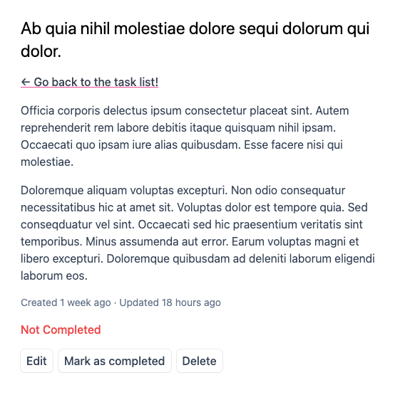
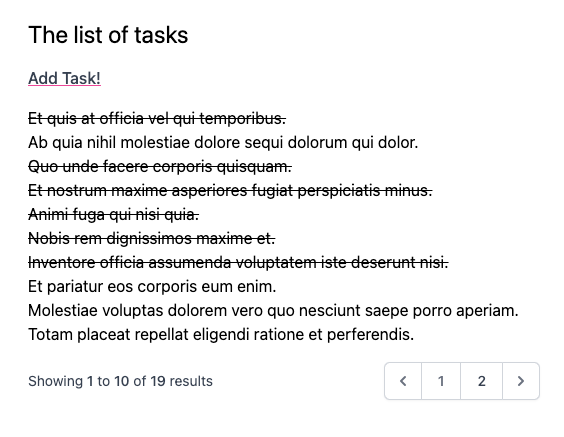
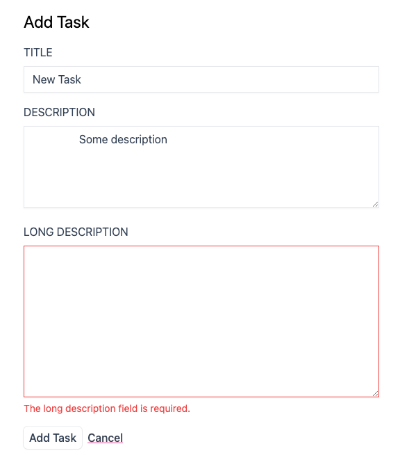
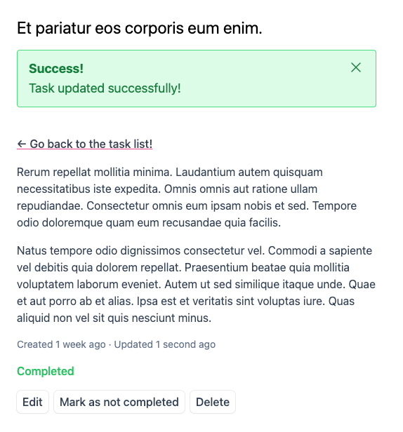

# Project #1 - Task List

<kbd></kbd>
<kbd></kbd>

<kbd></kbd>
<kbd></kbd>

## Using

- Laravel 10 Framework
- Blade Templates API
- Tailwind CSS Framework
- Alpine JavaScript Framework
- Models, Routing
- Forms, Validating, Sessions, Styling
